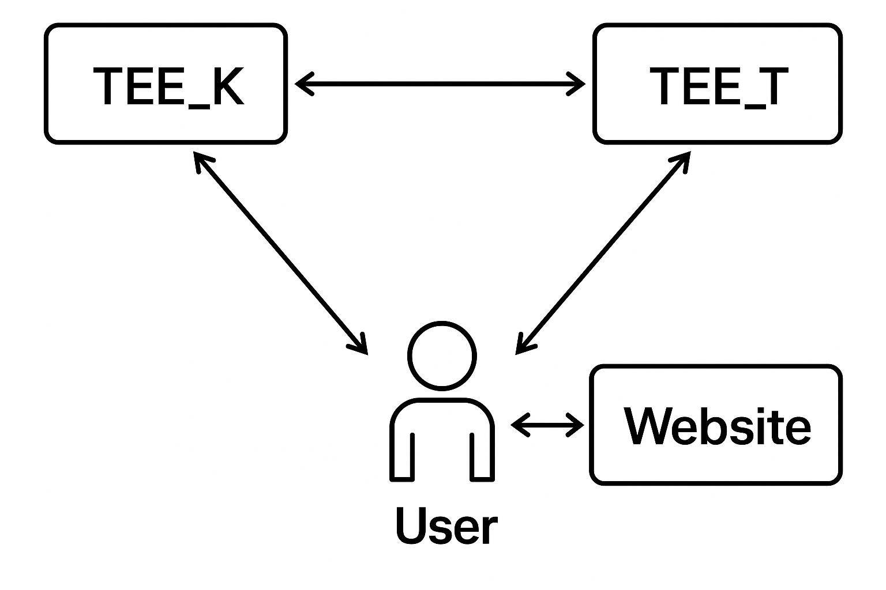

# New design research (TEE + MPC)

## Entities

- **User**: Runs the whole TLS session with the Website
- **TEE_K**: Trusted Execution Environment (hosted at a cloud provider) that holds TLS keys and performs encryption/decryption tasks.
- **TEE_T**: Trusted Execution Environment (hosted INDEPENDENTLY from a previous one at a cloud provider) that assists in tag computation without access to TLS keys.
- **Website**: The real Website with which the User communicates.
- **Verifier**: Validates the authenticity of the TLS transcript (hosted by a 3rd party, independent from Reclaim). This entity is a separate party that does not participate in the main protocol flow, though appears after the main protocol is done.

NOTE: due to the need to divide AEAD into two processes (encryption and MAC computation), further when we say “ciphertext” it means that it does not include tag (the latter is mentioned separately).

## Protocol Goals

- Ensure that a specific TLS transcript reflects communication between the User and the real Website, mediated by TEE_K and TEE_T.
- Maintain the transcript's authenticity and integrity while protecting the privacy of sensitive data.

## Assumptions

- Secure channels between TEE_K, TEE_T and User. Additionally, secure channel between the User and the Verifier
- Impossibility of collusion between any entities (assuming that this means collusion with cloud providers)
- TEEs’ integrity (i.e. they run their code)
- **Single request-response TLS session with the help of TEEs**
- Standard crypto assumptions

## Security Considerations

- The MPC protocol is provably 1-private, meaning that any “honest but curious” adversary cannot learn anything about others’ inputs.
- We are not interested about being 1-secure or 2-secure because we run code in TEEs, and so they cannot be malicious
- We are not interested in 2-private because we assume that cloud providers do not collude

## Visualization

---

## Protocol Phases

### 1. Pre-initialization and cookie computation

- **Goal**: Establish 3 secure channels (TLS sessions) between TEE_K and TEE_T, TEE_T and User, TEE_K and User. Additionally, the User prepares the cookie for a future single request-response TLS session.
- **Process**:
    1. Establish secure channels pairwise between parties, using TLS
    2. User navigates to the webpage with the target claim data and saves the established cookie

### 2. Initialization and TLS Handshake

- **Goal**: Establish a secure TLS connection between the User and the Website with the help of TEE_K.
- **Process**:
    1. User sends a request to the TEE_K to establish a connection with a Website, providing all the data necessary to know for TLS Handshake: 
        - **Hostname/IP address**
        - **Port number** (usually 443 for HTTPS/TLS)
        - **SNI (Server Name Indication)**
        - **ALPN (Application-Layer Protocol Negotiation)—**What protocols you support after TLS (like HTTP/2, HTTP/1.1)
    2. TEE_K conducts the TLS handshake with the Website through the User (i.e. the User is a proxy that sends data back and forth) on behalf of the User, establishing TLS session keys (further referred to as TLS keys). Note that the User learns nothing about the session keys at this stage.
    3. TEE_K discloses to the User the key used for Handshake, thus proving the validity of the connection (to avoid phishing) and, especially, the chain of certificates that appeared in the TLS handshake (this key is never used in the Record phase!). 
    In the case of TLS 1.2 this step can be avoided due to the lack of encryption in the Handshake
- **Flow scheme**
1. User → TEE_K: request for proof creation
2. TEE_K → User: TLS Client Hello
3. User → TEE_K: TLS Server Hello
4. TEE_K → User: Certificate reveal/Key for certificates reveal

### 3. Request Handling

- **Goal**: Enable the User to send authenticated requests to the Website while keeping each party’s sensitive data private.
- **Process**:
    1. The User constructs a request R, dividing it into 3 parts: non-sensitive R_NS (will go as a plaintext), sensitive R_S that is *not* going to be used in a proof, sensitive R_SP that is going to be used in a proof. 
    2. The User generates two random streams: Str_S, Str_SP, and two commitment keys: K_S, K_SP. Then the User applies Str_S to R_S (i.e. computing R_S \oplus Str_S) and Str_SP to R_SP without changing R_NS, thus producing R_red. Additionally, the User computes two commitments: 
        1. comm_s = HMAC(Str_S, K_S);
        2. comm_sp = HMAC(Str_SP, K_SP).
    3. The User sends R_red, comm_s and comm_sp to TEE_K (specifying the division into parts).
    4. TEE_K runs all the current request verifications to ensure that it looks like a request package to a correct website, does format compliance, validity of headers, etc.
    5. If the verifications passed, TEE_K encrypts the R_red (i.e. XORs it with a cipherstream) and sends the result R_red_Enc to the User and TEE_T. Additionally, TEE_K sends to TEE_T commitments comm_s and comm_sp and the data required for the Tag computation:
        1. E_K(0^{128}) and E_K(IV || 0^{31} || 1) in the case of AES-GCM for computation of GCM;
        2. First 32 bytes of the Stream Block derived using the key K, nonce N and counter 0 in the case of ChaCha20Poly1305 for computation of Poly1305.
    6. The User sends previously generated streams Str_S, Str_SP, and two commitment keys: K_S, K_SP to TEE_T.
    7. TEE_T verifies the correctness of commitments and then applies streams Str_S and Str_SP to the corresponding parts of R_red_Enc, thus getting R_Enc.
    8. TEE_T computes the authentication tag T and sends R_Enc and T to the User.
    9. The User transmits the fully encrypted request (R_Enc and T) to the Website.
- **Flow scheme**
1. User → TEE_K: redacted TLS request, commitments
2. TEE_K → User: “all verifications passed”
3. TEE_K → TEE_T: Encrypted redacted request, commitments, tag secrets
    1. User → TEE_T: Redaction streams, commitment keys
    2. TEE_T → User: Encrypted request, Tag
4. TEE_T → TEE_K: “all verifications passed”

### 4. Response Handling

- **Goal**: Process encrypted responses from the Website, commit to them, decrypt and verify the Tag.
- **Process**:
    1. The User receives an encrypted response Resp_Enc and Tag from the Website.
    2. The User sends the Resp_Enc, Tag to TEE_T.
    3. TEE_T sends the length of Resp_Enc to TEE_K (in the case of TLS 1.2 it additionally sends the IV from the response)
    4. TEE_K sends Tag Secrets (analogously to request handling) to TEE_T. 
    5. TEE_T computes the Tag for Resp_Enc and compares it with the original Tag. If everything is correct, TEE_T sends “success” messages to TEE_K and the User.
    6. TEE_K computes Str_Dec of the length of Resp for decryption of the Resp_Enc and sends it to the User.
    7. The User decrypts Resp_Enc (through XOR with Str_Dec), thus getting Resp.
- **Flow scheme**
1. User → TEE_T: encrypted response, tag
    1. TEE_T → TEE_K: length of response
    2. TEE_K → TEE_T: tag secrets
    3. TEE_T → TEE_K: “sucess” if Tag matches
2. TEE_K → User: decryption stream
3. TEE_T → User: “sucess” of Tag verification

### 5. Transcript Generation

- **Goal**: Finalize the TLS transcript and provide keys for proving the claim.
- **Process**:
1. The User identifies a set of symbols that contain secret data (analogously to the request), however, the data that is going to be proven is now treated as non-secret data. User sends the structure SecretData, specifying all the beginning and end each of the ranges with secret data, to TEE_K.
2. Upon receiving SecretData, TEE_K replaces in the stream Str_Dec all the symbol in ranges, specified in SecretData, with a gibberish symbol “*” (transforming Str_Dec into Str_Dec_Red). Additionally, TEE_K sends “finished” to TEE_T.
3. TEE_K signs the concatenation of: 
    1. Redacted Request
    2. Str_Dec_Red
    
    and sends it to the User.
    
4. Upon receiving “finished” from TEE_K, TEE_T signs the concatenation of:
    1. Resp_Enc
    2. Tag 
    3. Request Redaction Stream Str_SP (from the commitment opening)
    
    and sends it to the User.
    
5. The Output of the User contains:
    1. TEE_K’s output
    2. TEE_T’s output

### 6. Verification

- **Goal**: Enable the Verifier to confirm the TLS transcript's authenticity and Claim correctness.
- **Process**:
    1. The User submits to the Verifier the Output.
    2. The Verifier:
        - Parses it into TEE_K’s output and TEE_T’s output, and verifies each part’s signature
        - Parses each TEE’s output and applies Str_SP to Redacted Request (XORs with the corresponding parts)
        - Parses each TEE’s output and applies Str_Dec_Red to Resp_Enc (XORs these strings)
        - Validates that the outputs of 2 previous steps contain claim target data and verifies its location through XPath (since only some secrets are hidden in the response but its structure is explicitly visible)

---

## Generalization of the protocol (proof of the whole TLS session)

In general, it is possible to generalize the protocol to remove the cookie computation part and run the whole TLS through TEEs. It is a purely theoretical idea at the moment since it is not known about any security issues of the single request-response version (due to this cut).

To generalize the protocol we change steps 4-6 (preserving 1-3 as is without cookie computation).

### 4. Response Handling

- **Goal**: Process encrypted responses from the Website, commit to them, decrypt and verify the Tag.
- **Process**:
    1. The User receives an encrypted response Resp_Enc and Tag from the Website.
    2. The User sends the Resp_Enc, Tag to TEE_T.
    3. TEE_T sends the length of Resp_Enc to TEE_K.
    4. TEE_K sends Tag Secrets (analogously to request handling) to TEE_T. 
    5. TEE_T computes the Tag for Resp_Enc and compares it with the original Tag. If everything is correct, TEE_T sends “success” messages to TEE_K and the User.
    6. TEE_K computes the stream Str_Dec of the length of Resp for decryption of the Resp_Enc and sends it to the User.
    7. The User decrypts Resp_Enc (via computing XOR with the Str_Dec), thus getting Resp.
- **Flow scheme**
1. User → TEE_T: encrypted response, tag
    1. TEE_T → TEE_K: length of response
    2. TEE_K → TEE_T: tag secrets
    3. TEE_T → TEE_K: “sucess” if Tag matches
2. TEE_K → User: decryption stream
3. TEE_T → User: “sucess” of Tag verification

### 5. Transcript Generation and Key Disclosure

- **Goal**: Finalize the TLS transcript and provide keys for proving the claim.
- **Process**:
    1. After the final response, the User sends a special message “finished” to TEE_K and TEE_T.
    2. Upon receiveng, TEE_K sends “finished” to TEE_T.
    3. If TEE_T already received “finished” from User, it responds to TEE_K with “finished”, and “not finished” otherwise.
    4. If TEE_K receives “not finished” from TEE_K, it ignores the request from User and the Step 5 stops.
    5. TEE_K concatenates all the redacted requests, commitment to streams comm_sp, and signs all it. Further we call it request_transcript.
    6. TEE_T concatenates all the encrypted reponses and signs it. Further we call it response_transcript.
    7. TEE_K sends the signed request_transcript and TLS keys to the User. TEE_T sends the signed response_transcript to the User.
    8. The User creates ZK Proof that the response_transcript contains data for the Claim (using the TLS keys they learnt).
    9. The Output of the User contains:
        1. Signed request_transcript
        2. Signed reponse_transcript
        3. Request streams Str_SP and their commitment key K_SP
        4. ZK Proof for the claim target data (same as we have now)
- **Flow scheme**
1. User → TEE_T: “finished”
    1. User → TEE_K: “finished”
        1. TEE_K → TEE_T: “finished”
        2. TEE_T → TEE_K: “finished”
    2. TEE_K → User: signed “request transcript” and TLS keys
2. TEE_T → User: signed “response transcript”

### 6. Verification

- **Goal**: Enable the Verifier to confirm the TLS transcript's authenticity and Claim correctness.
- **Process**:
    1. The User submits to the Verifier the Output.
    2. The Verifier:
        - Checks the request_transcript’s and response_transcript’s signatures to confirm their authenticity.
        - Verifies request stream commitment and apply Stream Str_SP to the corresponding parts of requests.